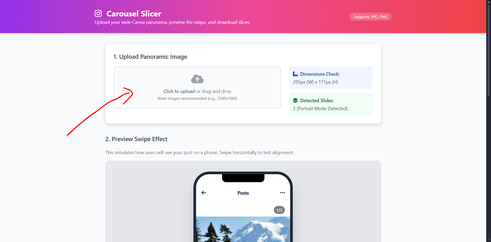
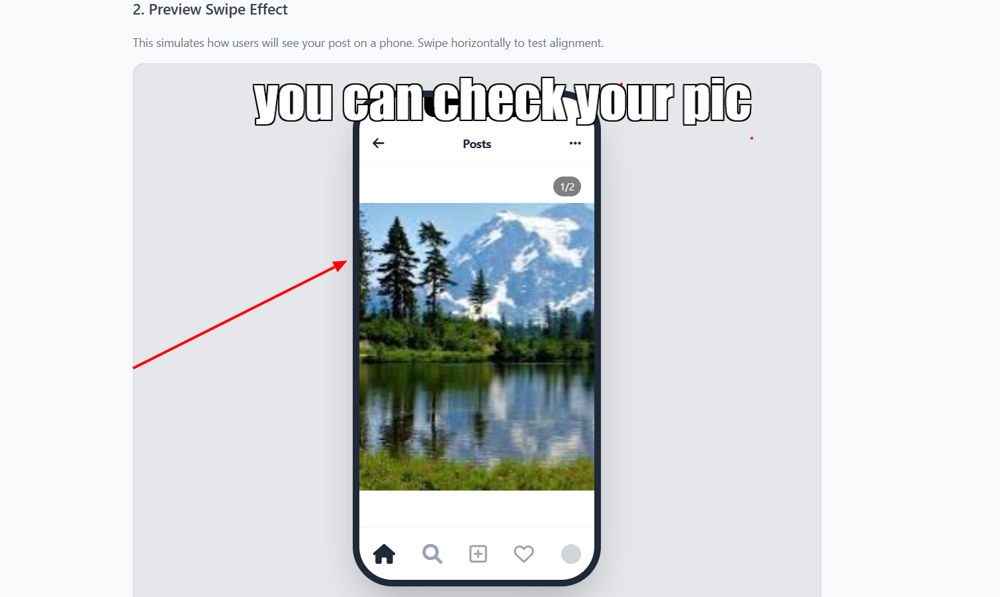
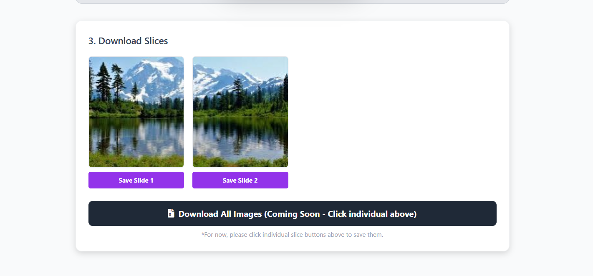

# Instagram Carousel Slicer & Previewer

A simple, powerful web tool designed to help creators split wide panoramic images into seamless Instagram carousel slides. Perfect for photographers, designers, and content creators who design continuous swipeable posts in tools like Canva or Photoshop.

## Features

-   **Smart Upload:** Supports wide panoramic images (JPG, PNG).
-   **Auto-Detection:** Automatically calculates dimensions and detects the number of slides based on standard Instagram aspect ratios (1:1 or 4:5).
-   **Interactive Preview:** Simulates the Instagram mobile experience with a swipeable preview inside a phone mockup.
-   **Seamless Slicing:** Splits your panorama into individual high-quality images ready for posting.
-   **Client-Side Processing:** All image processing happens directly in your browser for privacy and speed.

## How to Use

### 1. Upload Panoramic Image
First, upload your wide image. The tool supports drag-and-drop and file selection.

### 2. Preview Swipe Effect
Visualize how your post will look on a phone. You can swipe through the carousel to ensure the alignment is perfect.

### 3. Download Slices
Once satisfied, download the individual slices. These are perfectly cut and ready to be posted on Instagram in order.

## Technologies Used

-   **HTML5**
-   **Tailwind CSS** (via CDN) for styling.
-   **FontAwesome** for icons.
-   **JavaScript** for image processing and DOM manipulation.

## Setup

No installation required. Simply open `index.html` in any modern web browser.

## Keywords & Topics

`instagram-carousel` `panorama-splitter` `image-slicer` `instagram-tools` `seamless-carousel` `canva-to-instagram` `grid-maker` `web-tool` `javascript` `njr-tools` `open-source`
